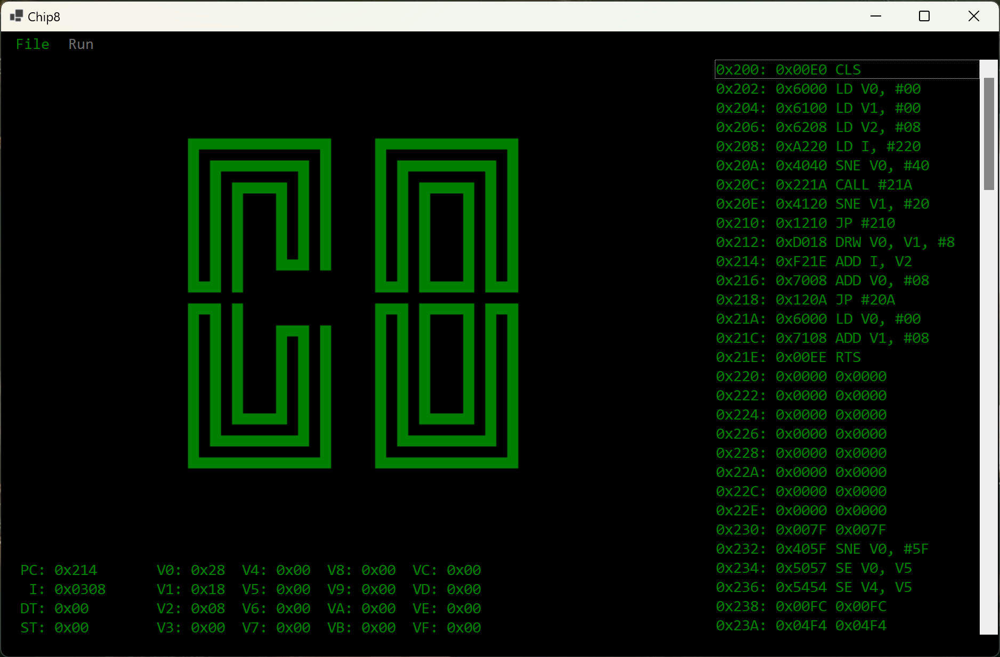

# Chip-8 Emulator

A C# SDL and WinForms implementations of a Chip-8 emulator. I make no warranty to it's
correctness but it passes the test roms I've given it so far.

This code is licensed under the [MIT license](LICENSE.txt) except the files in the `roms`
directory which have been downloaded from other projects. Each of these `rom`
files is under their own license or of unknown license. See the accompanying
`txt` files. If I have mistakenly used your `rom` without permission, please
let me know and I will take it down immediately.